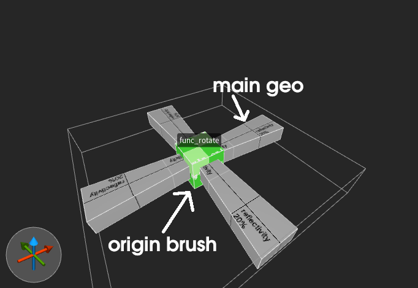

With the `DP_SV_ROTATINGBMODEL` QuakeC extension, brush entities can be made to
rotate using the `.avelocity` field. The brush entity must have an "origin brush"
or else it will rotate around the map origin.



To create an origin brush, create another brush in your level editor of choice
and make it a part of the entity. The center of the new brush should be where
you want the entity to rotate from. The new brush should also have an "ORIGIN"
texture on it, so the map compiler can properly mark it as the center of that
entity. In Q1-based games, this is usually just a texture named "ORIGIN" with no
other special properties. In Q2-based games, it will be a texture with the "ORIGIN"
contents flag set.

Finally, it needs some extra additions in QuakeC. In your entities `.think`
function, assign the `.avelocity` field to a vector representing the rotation,
in degrees per second.

**NOTE**: If you're having issues getting this to work, try using the
`checkextension` builtin to query the `DP_SV_ROTATINGBMODEL` extension before
using it.

## Example Code

Here is an extremely basic `func_rotate` implementation in QuakeC for FTE:

```c
enumflags {
	FUNC_ROTATE_X_AXIS,
	FUNC_ROTATE_Y_AXIS,
	FUNC_ROTATE_Z_AXIS
};

void func_rotate_think()
{
	// do rotations
	if (self.spawnflags & FUNC_ROTATE_X_AXIS)
		self.avelocity.x = self.speed;
	if (self.spawnflags & FUNC_ROTATE_Y_AXIS)
		self.avelocity.y = self.speed;
	if (self.spawnflags & FUNC_ROTATE_Z_AXIS)
		self.avelocity.z = self.speed;

	self.nextthink = self.ltime + 0.1;
}

void func_rotate()
{
	// setup brush model
	setorigin(self, self.origin);
	setmodel(self, self.model);
	self.movetype = MOVETYPE_PUSH;
	self.solid = SOLID_BSP;

	// start thinking
	self.think = func_rotate_think;
	self.nextthink = self.ltime + 0.1;
}
```
